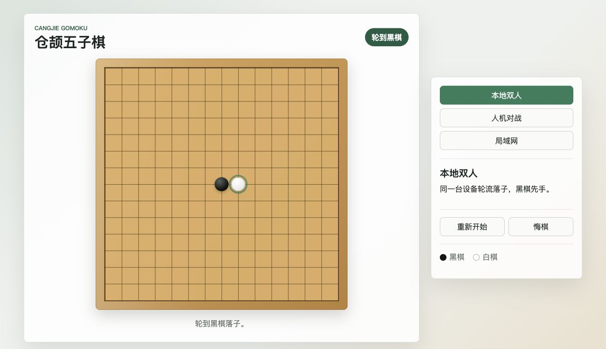
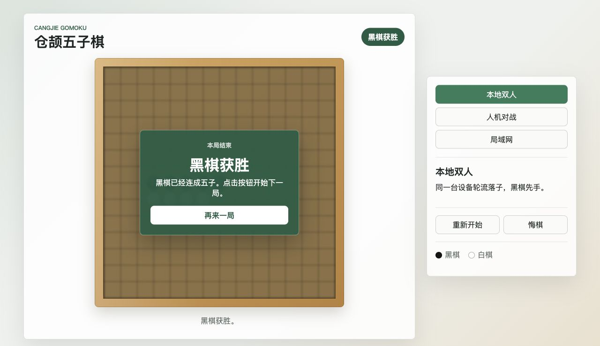

# 仓颉网页版五子棋实验报告

## 一、模型介绍

本项目借助 OpenAI Codex 完成需求拆解、方案设计、仓颉代码实现、前端页面实现、测试与文档整理。开发过程中使用了本地终端工具、文件编辑工具和仓颉工具链 `cjc/cjpm 1.0.5`。为了确认仓颉标准库网络 API 的可行性，参考了仓颉官方文档中 `std.net`、TCP 示例和 `cjpm` 说明。

项目没有下载第三方依赖，后端基于仓颉标准库 `std.net` 实现 TCP 监听和最小 HTTP 协议处理，前端静态资源由仓颉后端读取并返回，满足“不可以是纯前端项目”的要求。

## 二、与 AI 交互聊天截图及说明

本次开发使用了 Plan Mode 先形成实现计划，再根据计划执行编码。关键节点如下：

1. 需求确认：明确必须完成本地双人、人机对战，并将可选的局域网联机也纳入实现范围。
2. 技术选型：确认本地存在仓颉 `cjc/cjpm 1.0.5`，决定使用 `cjpm` 可执行项目和 `std.net` 自建 HTTP 服务。
3. 方案计划：形成 `PLAN.md` 中的实现计划，确定局域网联机采用 HTTP 轮询房间制。
4. 实现调试：先用临时仓颉项目验证集合、字符串、文件读取、TCP 服务端、单元测试宏等语法，再写正式代码。
5. 验收测试：运行 `cjpm build` 和 `cjpm test`，确认构建与核心单元测试通过。


## 三、项目说明

### 3.1 项目介绍

本项目是一个网页版五子棋游戏。浏览器页面提供三种模式：

- 本地双人：同一台设备上双方轮流落子。
- 人机对战：玩家执黑，仓颉后端 AI 执白。
- 局域网联机：一台设备创建房间，另一台设备在同一局域网访问服务并加入房间，双方通过 HTTP 轮询同步棋局。

规则采用 15x15 棋盘，黑棋先手，无禁手，横、竖、斜任意方向连续五枚或更多即判胜。

### 3.2 项目目录结构

```text
.
├── cjpm.toml
├── src
│   ├── main.cj
│   ├── http.cj
│   ├── game.cj
│   ├── rooms.cj
│   └── game_test.cj
├── public
│   ├── index.html
│   └── assets
│       ├── app.js
│       └── styles.css
├── PLAN.md
├── README.md
└── REPORT.md
```

### 3.3 项目运行及结果

运行命令：

```bash
cjpm run
```

浏览器访问：

```text
http://localhost:8080
```

局域网联机时，在创建房间电脑上保持服务运行，另一台设备访问：

```text
http://创建房间电脑的局域网IP:8080
```

测试命令：

```bash
cjpm build
cjpm test
```

本地验证结果：

- `cjpm build`：通过。
- `cjpm test`：通过，7 个测试全部成功。

运行截图：

- 本地运行页面：


- 棋子落在交叉点上的效果：



- 结算弹层效果：



- 局域网房间截图：

  

## 四、经验技巧与心得体会

1. Plan mode 可以更好地提前明确需求，使模型更准确地完成任务。
2. codex 的“追求目标”模式可以使模型持续推进任务，适合用于任务比较长、需要多轮试错、并且有明确验收标准的场景。
